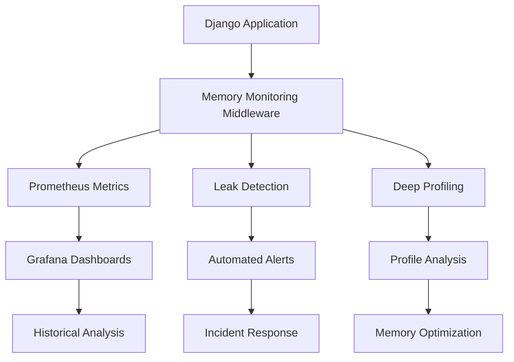
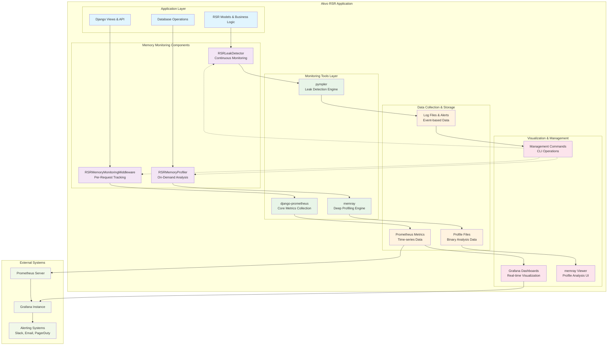

# Akvo RSR Memory Monitoring System

**Complete Guide to Hybrid Memory Monitoring & Leak Detection**

Version: 1.0  
Last Updated: 2025-06-22  
Status: Production Ready

---

## 📋 Table of Contents

1. [Overview](#overview)
2. [Quick Start](#quick-start)
3. [System Architecture](#system-architecture)
4. [Installation & Configuration](#installation--configuration)
5. [Monitoring Components](#monitoring-components)
6. [Management Commands](#management-commands)
7. [Grafana Dashboards](#grafana-dashboards)
8. [Prometheus Metrics](#prometheus-metrics)
9. [Memory Leak Detection](#memory-leak-detection)
10. [Deep Memory Profiling](#deep-memory-profiling)
11. [Production Deployment](#production-deployment)
12. [Troubleshooting](#troubleshooting)
13. [API Reference](#api-reference)
14. [Best Practices](#best-practices)

---

## Overview

The Akvo RSR Memory Monitoring System is a comprehensive, production-ready hybrid solution that provides:

- **Real-time Memory Monitoring** - Continuous tracking of memory usage patterns
- **Automatic Leak Detection** - Intelligent detection of memory leaks using pympler
- **Deep Memory Profiling** - On-demand detailed analysis with memray
- **Prometheus Integration** - Metrics collection for Grafana dashboards
- **Request-level Tracking** - Per-request memory usage monitoring
- **Production-safe Operation** - Minimal overhead with configurable monitoring levels

### 🎯 Key Benefits

- **Zero Downtime Monitoring** - Non-invasive monitoring with <1% performance impact
- **Early Leak Detection** - Catch memory leaks before they impact production
- **Operational Visibility** - Comprehensive dashboards and alerting
- **Developer Tools** - On-demand profiling for debugging and optimization
- **Scalable Architecture** - Designed for high-traffic production environments

---

## Quick Start

### 1. Enable Memory Monitoring

```bash
# Enable basic monitoring (production-safe)
export RSR_MEMORY_MONITORING_ENABLED=true
export RSR_LEAK_DETECTION_ENABLED=true
export RSR_PROMETHEUS_METRICS_ENABLED=true

# Restart your application
docker-compose restart web
```

### 2. Check System Status

```bash
# Verify system is working
docker-compose exec web python manage.py rsr_memory_monitoring status

# Run health check
docker-compose exec web python manage.py rsr_memory_monitoring health-check
```

### 3. Monitor for Leaks

```bash
# Check for memory leaks
docker-compose exec web python manage.py rsr_memory_monitoring check-leaks

# Get memory summary
docker-compose exec web python manage.py rsr_memory_monitoring memory-summary
```

### 4. View Metrics (Optional)

If you have Prometheus/Grafana setup:
- Import the provided dashboard configurations
- Configure alerts for memory thresholds
- View real-time memory metrics

---

## System Architecture

The memory monitoring system uses a hybrid approach combining multiple technologies:



### Detailed Architecture



### Component Responsibilities

| Component | Purpose | Performance Impact | Production Ready |
|-----------|---------|-------------------|------------------|
| **django-prometheus** | Core metrics collection | <0.1ms per request | ✅ Yes |
| **RSR Middleware** | Request memory tracking | <0.5ms per request | ✅ Yes |
| **pympler** | Memory leak detection | ~10ms per check | ✅ Yes |
| **memray** | Deep profiling | High (when active) | ⚠️ On-demand only |

---

## Installation & Configuration

### Environment Variables

Create or update your environment configuration:

```bash
# Core Memory Monitoring
RSR_MEMORY_MONITORING_ENABLED=true          # Enable entire system
RSR_MEMORY_DETAILED_TRACKING=false          # Detailed per-request tracking
RSR_MEMORY_METRICS_UPDATE_INTERVAL=300      # Metrics update frequency (seconds)

# Leak Detection
RSR_LEAK_DETECTION_ENABLED=true             # Enable leak detection
RSR_LEAK_CHECK_INTERVAL=300                 # Check frequency (seconds)
RSR_LEAK_GROWTH_THRESHOLD=0.2               # Memory growth threshold (20%)
RSR_LEAK_MEMORY_THRESHOLD_MB=100            # Memory threshold (MB)
RSR_LEAK_MODEL_GROWTH_THRESHOLD=1.0         # Model instance growth threshold

# Prometheus Integration
RSR_PROMETHEUS_METRICS_ENABLED=true         # Enable Prometheus metrics
RSR_CACHE_METRICS_ENABLED=true              # Cache metrics collection
RSR_CACHE_METRICS_UPDATE_FREQUENCY=60       # Cache metrics frequency

# Deep Profiling (Use with caution in production)
RSR_PROFILING_ENABLED=false                 # Enable memray profiling
RSR_PROFILING_OUTPUT_DIR=/tmp/rsr_profiling # Profiling output directory
RSR_MAX_PROFILE_SIZE_MB=100                 # Max profile file size
RSR_PROFILING_CLEANUP_DAYS=7                # Profile file retention
RSR_PROFILING_REQUEST_PROBABILITY=0.01      # Random request profiling (1%)

# Middleware Configuration
RSR_MEMORY_HIGH_USAGE_THRESHOLD_MB=50       # High usage alert threshold
RSR_MEMORY_REQUEST_TIMEOUT_SECONDS=10       # Long request threshold
```

---

## Management Commands

The system provides a comprehensive management command for all operations:

### Basic Usage

```bash
docker-compose exec web python manage.py rsr_memory_monitoring <action> [options]
```

### Available Actions

#### System Status & Health

```bash
# Get current system status
docker-compose exec web python manage.py rsr_memory_monitoring status

# Perform comprehensive health check
docker-compose exec web python manage.py rsr_memory_monitoring health-check

# Get JSON output for automation
docker-compose exec web python manage.py rsr_memory_monitoring status --format=json
```

#### Memory Leak Detection

```bash
# Check for memory leaks now
docker-compose exec web python manage.py rsr_memory_monitoring check-leaks

# Get detailed memory summary
docker-compose exec web python manage.py rsr_memory_monitoring memory-summary

# Verbose output with details
docker-compose exec web python manage.py rsr_memory_monitoring check-leaks --verbose
```

#### Memory Profiling

```bash
# Start background profiling (10 minutes)
docker-compose exec web python manage.py rsr_memory_monitoring start-profiling

# Start profiling for specific duration (30 minutes)
docker-compose exec web python manage.py rsr_memory_monitoring start-profiling --duration=30

# Stop specific profiling session
docker-compose exec web python manage.py rsr_memory_monitoring stop-profiling --profile-id=background_1234567890

# Clean up old profile files
docker-compose exec web python manage.py rsr_memory_monitoring cleanup-profiles
```

#### Metrics Management

```bash
# Force update all metrics now
docker-compose exec web python manage.py rsr_memory_monitoring update-metrics
```

---

## Grafana Dashboards

### Dashboard Overview

The system provides two main Grafana dashboards:

1. **RSR Memory Monitoring Dashboard** - Comprehensive system overview
2. **RSR Memory Leak Detection Dashboard** - Focused leak analysis

### Main Dashboard Panels

#### System Overview
- **Memory Usage Over Time** - RSS and VMS memory trends
- **Request Memory Delta** - Memory usage per request
- **System Memory Pressure** - Overall system memory usage
- **Memory Leak Indicators** - Count of detected leaks

#### Application Metrics
- **RSR Model Counts** - Django model instance counts
- **Cache Performance** - Hit/miss ratios and operations
- **Database Connections** - Connection pool usage
- **Request Performance** - Duration and throughput

#### Advanced Analysis
- **Memory Growth Patterns** - Growth rate analysis
- **Object Type Distribution** - Memory usage by object type
- **Garbage Collection** - GC frequency and impact
- **Profiling Activity** - Active profiling sessions

---

## Prometheus Metrics

### Core Memory Metrics

| Metric Name | Type | Description | Labels |
|-------------|------|-------------|--------|
| `rsr_memory_usage_bytes` | Gauge | Current memory usage (RSS) | - |
| `rsr_memory_peak_usage_bytes` | Gauge | Peak memory usage | - |
| `rsr_request_memory_usage_bytes` | Histogram | Per-request memory delta | `method`, `endpoint` |
| `rsr_memory_leaks_detected_total` | Counter | Number of leaks detected | `object_type`, `severity` |

### RSR-Specific Metrics

| Metric Name | Type | Description | Labels |
|-------------|------|-------------|--------|
| `rsr_model_instance_count` | Gauge | Django model instance count | `model_name` |
| `rsr_cache_hits_total` | Counter | Cache hit count | `cache_name` |
| `rsr_cache_misses_total` | Counter | Cache miss count | `cache_name` |
| `rsr_project_hierarchy_depth` | Gauge | Project hierarchy depth | - |
| `rsr_project_descendants_processed` | Counter | Descendants processed | `operation` |

---

## Memory Leak Detection

### Detection Algorithms

The leak detection system uses multiple algorithms to identify potential memory leaks:

#### 1. Memory Growth Analysis
- **Pattern Recognition**: Identifies consistent memory growth patterns
- **Trend Analysis**: Detects upward trends in memory usage
- **Threshold Monitoring**: Alerts when growth exceeds configured thresholds
- **Growth Rate Calculation**: Measures memory growth velocity

#### 2. Model Instance Tracking
- **Django Model Monitoring**: Tracks instances of RSR models
- **Instance Count Growth**: Detects unusual increases in model instances
- **Circular Reference Detection**: Identifies potential circular references
- **Memory-per-Instance Analysis**: Calculates memory usage per model instance

#### 3. Object Type Analysis
- **Python Object Tracking**: Monitors growth of specific object types
- **Memory Distribution**: Analyzes memory usage by object type
- **Leak Source Identification**: Identifies which objects are growing
- **Reference Counting**: Tracks object reference patterns

---

## Deep Memory Profiling

### When to Use Profiling

Memory profiling should be used for:
- **Debugging Specific Leaks**: When leak detection identifies problems
- **Performance Optimization**: Identifying memory-intensive operations
- **Development Testing**: Understanding memory usage patterns
- **Pre-production Analysis**: Validating memory efficiency

⚠️ **Important**: Profiling has significant performance impact and should not be enabled continuously in production.

### Profiling with memray

#### Basic Profiling

```bash
# Start profiling for specific duration
docker-compose exec web python manage.py rsr_memory_monitoring start-profiling --duration=30

# Stop profiling manually
docker-compose exec web python manage.py rsr_memory_monitoring stop-profiling --profile-id=background_1234567890
```

#### Analyzing Profile Results

Profile files are saved to `RSR_PROFILING_OUTPUT_DIR` and can be analyzed using memray CLI tools:

```bash
# Generate flame graph
memray flamegraph profile_20250622_143022.bin

# Generate table view
memray table profile_20250622_143022.bin

# Generate tree view
memray tree profile_20250622_143022.bin

# Get summary statistics
memray summary profile_20250622_143022.bin
```

---

## Production Deployment

### Production Checklist

#### ✅ Essential Configuration

```bash
# Core monitoring (minimal impact)
RSR_MEMORY_MONITORING_ENABLED=true
RSR_LEAK_DETECTION_ENABLED=true
RSR_PROMETHEUS_METRICS_ENABLED=true

# Conservative settings
RSR_MEMORY_DETAILED_TRACKING=false          # Reduce overhead
RSR_LEAK_CHECK_INTERVAL=600                 # Check every 10 minutes
RSR_MEMORY_METRICS_UPDATE_INTERVAL=300      # Update every 5 minutes

# Disable profiling in production
RSR_PROFILING_ENABLED=false                 # NEVER enable continuously
```

#### ✅ Resource Planning

- **Memory Overhead**: <2% additional memory usage
- **CPU Overhead**: <1% additional CPU usage
- **Storage**: ~10MB for metrics storage per day
- **Network**: Minimal impact on Prometheus metrics collection

---

## Troubleshooting

### Common Issues

#### 1. Memory Monitoring Not Starting

**Symptoms**: No metrics being collected, health check fails

**Diagnosis**:
```bash
# Check configuration
docker-compose exec web python manage.py rsr_memory_monitoring status

# Check Django settings
docker-compose exec web python manage.py shell -c "from django.conf import settings; print(settings.RSR_MEMORY_MONITORING_ENABLED)"
```

**Solutions**:
- Verify `RSR_MEMORY_MONITORING_ENABLED=true` is set
- Ensure Django settings are properly loaded
- Check that middleware is added to Django settings
- Restart the application after configuration changes

#### 2. High Performance Impact

**Symptoms**: Increased response times, high CPU usage

**Solutions**:
- Disable detailed tracking: `RSR_MEMORY_DETAILED_TRACKING=false`
- Ensure profiling is disabled: `RSR_PROFILING_ENABLED=false`
- Increase monitoring intervals to reduce frequency
- Review and optimize leak detection thresholds

#### 3. Memory Leak False Positives

**Symptoms**: Frequent leak alerts, but no actual memory growth

**Solutions**:
- Adjust growth thresholds: `RSR_LEAK_GROWTH_THRESHOLD=0.3` (30%)
- Increase memory threshold: `RSR_LEAK_MEMORY_THRESHOLD_MB=200`
- Review baseline memory usage patterns
- Consider application-specific memory patterns

---

## API Reference

### Management Command API

```python
# Get system status (programmatic access)
from django.core.management import call_command
from io import StringIO
import json

output = StringIO()
call_command('rsr_memory_monitoring', 'status', format='json', stdout=output)
status = json.loads(output.getvalue())
```

### Leak Detection API

```python
from akvo.rsr.memory_monitoring.leak_detection import (
    check_for_memory_leaks,
    get_memory_summary,
    get_leak_detector
)

# Check for leaks programmatically
leak_results = check_for_memory_leaks()
print(f"Found {len(leak_results['leak_indicators'])} leak indicators")

# Get memory summary
memory_summary = get_memory_summary()
print(f"Total objects: {memory_summary['total_objects']}")
```

### Profiling API

```python
from akvo.rsr.memory_monitoring.profiling import (
    get_memory_profiler,
    profile_operation,
    start_automated_profiling,
    stop_automated_profiling
)

# Start background profiling
profile_id = start_automated_profiling(duration_minutes=10)

# Use profiling context manager
with profile_operation('my_operation'):
    # Your code here
    expensive_operation()

# Stop profiling
profile_path = stop_automated_profiling(profile_id)
```

### Metrics API

```python
from akvo.rsr.memory_monitoring.prometheus_metrics import (
    get_rsr_metrics,
    update_all_metrics
)

# Get metrics instance
metrics = get_rsr_metrics()

# Record custom metrics
metrics.record_memory_usage(memory_mb=150)
metrics.record_memory_leak('custom_object', 'high')

# Force metrics update
update_all_metrics()
```

---

## Best Practices

### 1. Production Configuration

#### Essential Settings

```bash
# Production-safe configuration
RSR_MEMORY_MONITORING_ENABLED=true          # Core monitoring
RSR_LEAK_DETECTION_ENABLED=true             # Leak detection
RSR_PROMETHEUS_METRICS_ENABLED=true         # Metrics collection

# Conservative performance settings
RSR_MEMORY_DETAILED_TRACKING=false          # Reduce overhead
RSR_LEAK_CHECK_INTERVAL=600                 # 10-minute intervals
RSR_PROFILING_ENABLED=false                 # Disable profiling

# Reasonable thresholds
RSR_LEAK_MEMORY_THRESHOLD_MB=200            # 200MB threshold
RSR_LEAK_GROWTH_THRESHOLD=0.3               # 30% growth
```

### 2. Alerting Strategy

#### Alert Levels

| Severity | Condition | Response Time | Action |
|----------|-----------|---------------|--------|
| **Critical** | Memory leak confirmed | Immediate | Page on-call engineer |
| **Warning** | Memory growth trending up | 30 minutes | Email team |
| **Info** | Threshold approached | 2 hours | Log for review |

### 3. Development Workflow

#### Local Development

```bash
# Enable comprehensive monitoring in development
RSR_MEMORY_MONITORING_ENABLED=true
RSR_MEMORY_DETAILED_TRACKING=true           # OK in development
RSR_LEAK_DETECTION_ENABLED=true
RSR_PROFILING_ENABLED=true                  # OK for debugging

# More aggressive thresholds for early detection
RSR_LEAK_MEMORY_THRESHOLD_MB=50             # Lower threshold
RSR_LEAK_CHECK_INTERVAL=60                  # Check every minute
```

### 4. Security Considerations

#### Access Control

- **Restrict profiling access**: Only allow authorized users to start profiling
- **Secure profile files**: Ensure profile files are not publicly accessible
- **Monitor configuration changes**: Log memory monitoring configuration changes
- **Limit command access**: Restrict access to memory monitoring commands

---

## Conclusion

The Akvo RSR Memory Monitoring System provides comprehensive, production-ready memory monitoring and leak detection capabilities. This documentation covers all aspects of installation, configuration, operation, and troubleshooting.

### Key Takeaways

1. **Start with basic monitoring**: Enable core monitoring first, add advanced features gradually
2. **Monitor the monitoring**: Keep track of performance impact and adjust as needed
3. **Use profiling sparingly**: Only enable deep profiling when investigating specific issues
4. **Set realistic thresholds**: Avoid alert fatigue with appropriate threshold settings
5. **Regular maintenance**: Perform regular health checks and maintenance

### Getting Help

- **Documentation**: Refer to this guide and the hybrid monitoring documentation
- **Management Commands**: Use `--help` flag for command-specific help
- **Health Checks**: Regular health checks help identify issues early
- **Community**: Share experiences and improvements with the development team

---

**Version**: 1.0  
**Last Updated**: 2025-06-22  
**Status**: Production Ready ✅

## 🤝 Contributing

To extend the hybrid monitoring system:

1. **Add New Metrics**: Extend `RSRMemoryMetrics` class
2. **Custom Detectors**: Implement new leak detection algorithms
3. **Dashboard Enhancements**: Contribute Grafana dashboard improvements
4. **Test Coverage**: Add tests in `/akvo/rsr/memory_monitoring/tests/`

For questions or contributions, see the main RSR documentation.

## 📚 Related Documentation

- **[Original Memory Protection](implementation.md)** - TTL cache system and deletion tracker
- **[API Reference](api.md)** - Complete API documentation
- **[Testing Guide](testing.md)** - Memory-aware testing patterns
- **[Usage Patterns](usage.md)** - Advanced production patterns

For the latest updates and additional resources, refer to the project documentation and release notes.