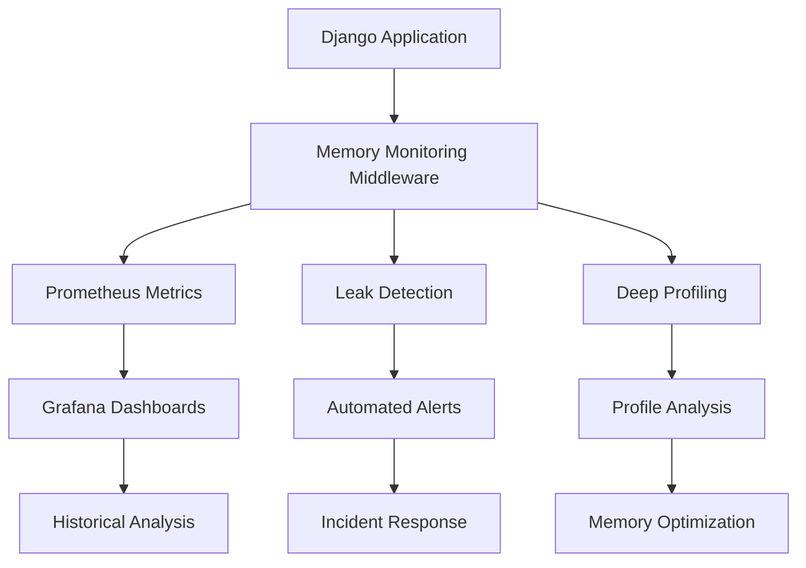

# Hybrid Memory Monitoring System

RSR's hybrid memory monitoring system provides comprehensive memory management for production environments, combining proven external tools with RSR-specific customizations.

## 📊 System Overview

The hybrid monitoring system consists of four integrated components:



### Core Components

1. **Prometheus Metrics Collection** - Real-time metrics with django-prometheus
2. **Enhanced Leak Detection** - Automated detection using pympler
3. **Deep Memory Profiling** - On-demand analysis with memray
4. **Grafana Visualization** - Dashboards and alerting

## 🚀 Quick Setup

### 1. Environment Configuration

Copy the environment template and customize:

```bash
cp akvo/settings/env.template .env
```

**Essential Production Settings**:
```bash
# Core monitoring (recommended for production)
RSR_MEMORY_MONITORING_ENABLED=true
RSR_PROMETHEUS_METRICS_ENABLED=true
RSR_LEAK_DETECTION_ENABLED=true

# Conservative thresholds for production
RSR_LEAK_GROWTH_THRESHOLD=0.2  # 20% memory growth
RSR_LEAK_MEMORY_THRESHOLD_MB=100

# Disable profiling in production (enable only for debugging)
RSR_PROFILING_ENABLED=false
```

### 2. Middleware Integration

The middleware is automatically configured in `/akvo/settings/42-memory-monitoring.conf`. No manual configuration required.

### 3. Verify Installation

```bash
# Check system health
python manage.py rsr_memory_monitoring health-check

# Verify metrics endpoint
curl http://localhost:8000/metrics/ | head -20
```

## 📈 Prometheus Metrics

### Exposed Metrics

| Metric | Type | Description |
|--------|------|-------------|
| `rsr_memory_usage_bytes` | Gauge | Current memory usage |
| `rsr_memory_peak_usage_bytes` | Gauge | Peak memory usage |
| `rsr_request_memory_usage_mb` | Histogram | Per-request memory usage |
| `rsr_cache_hits_total` | Counter | Cache hit count by cache name |
| `rsr_cache_misses_total` | Counter | Cache miss count by cache name |
| `rsr_memory_leaks_detected_total` | Counter | Memory leaks by type and severity |
| `rsr_model_instance_count` | Gauge | Django model instance count |
| `rsr_object_growth_rate` | Gauge | Object growth rate by type |
| `rsr_deletion_tracker_size` | Gauge | Deletion tracker size |
| `rsr_project_hierarchy_depth` | Histogram | Project hierarchy depth distribution |

### Custom Metrics Example

```python
from akvo.rsr.memory_monitoring.prometheus_metrics import get_rsr_metrics

# Record custom metrics
metrics = get_rsr_metrics()
metrics.record_memory_usage(current_mb=150.5, peak_mb=200.0)
metrics.record_cache_operation('hit', 'project_cache')
metrics.record_memory_leak('django_model', 'medium')
```

### Metrics Endpoint

Visit `/metrics/` in your browser or:

```bash
curl http://localhost:8000/metrics/
```

## 🔍 Memory Leak Detection

### Automatic Detection

The leak detector runs automatically every 5 minutes (configurable) and checks for:

- **Memory Growth**: >20% memory increase
- **Model Instance Growth**: >100% increase in Django model instances  
- **Object Accumulation**: Unusual object growth patterns
- **High Memory Usage**: Memory usage above configured thresholds

### Manual Leak Checks

```bash
# Run immediate leak detection
python manage.py rsr_memory_monitoring check-leaks

# Get detailed memory summary
python manage.py rsr_memory_monitoring memory-summary

# JSON output for automation
python manage.py rsr_memory_monitoring check-leaks --format=json
```

### Leak Detection Configuration

```bash
# Detection intervals and thresholds
RSR_LEAK_CHECK_INTERVAL=300  # 5 minutes
RSR_LEAK_GROWTH_THRESHOLD=0.2  # 20% growth
RSR_LEAK_MEMORY_THRESHOLD_MB=100
RSR_LEAK_MODEL_GROWTH_THRESHOLD=1.0  # 100% model growth
```

### Example Output

```bash
$ python manage.py rsr_memory_monitoring check-leaks

Found 2 leak indicators:
  [HIGH] Memory growth detected: 25.3% increase over 5 minutes
  [MEDIUM] Model instance growth: Project count increased by 120%

Recommendations:
  • Review recent project creation patterns
  • Check for unclosed database connections
  • Monitor cache size and TTL settings
```

## 🔬 Deep Memory Profiling

### When to Use Profiling

Enable profiling for:
- **Development debugging** - Understanding memory usage patterns
- **Performance investigation** - Analyzing memory hotspots
- **Pre-production testing** - Validating memory behavior

⚠️ **Warning**: Profiling impacts performance. Only enable when needed.

### Background Profiling

```bash
# Start background profiling for 10 minutes
python manage.py rsr_memory_monitoring start-profiling --duration=10

# Check active profilers
python manage.py rsr_memory_monitoring stop-profiling
# Output: Specify --profile-id to stop a profiler

# Stop specific profiler
python manage.py rsr_memory_monitoring stop-profiling --profile-id=background_1640995200
```

### Request-Level Profiling

```python
from akvo.rsr.memory_monitoring.profiling import profile_request_if_enabled

# Automatic probabilistic profiling (1% of requests by default)
def my_view(request):
    with profile_request_if_enabled(f'view_{request.path}'):
        # Your view logic here
        return response
```

### Profile Analysis

After profiling, analyze results with memray CLI:

```bash
# Generate flamegraph
memray flamegraph /tmp/rsr_memory_profiles/profile_20240101_120000.bin

# Generate table report
memray table /tmp/rsr_memory_profiles/profile_20240101_120000.bin

# Generate tree view
memray tree /tmp/rsr_memory_profiles/profile_20240101_120000.bin

# Summary report
memray summary /tmp/rsr_memory_profiles/profile_20240101_120000.bin
```

### Profile Management

```bash
# Clean up old profiles (older than 7 days by default)
python manage.py rsr_memory_monitoring cleanup-profiles

# Get profiling statistics
python manage.py rsr_memory_monitoring status
```

## 📊 Grafana Dashboards

### Dashboard Installation

1. **Import Dashboard JSON**:
   - Copy content from `/akvo/rsr/memory_monitoring/grafana/rsr_memory_monitoring_dashboard.json`
   - In Grafana: Import → Paste JSON → Import

2. **Configure Data Source**:
   - Add Prometheus data source pointing to your metrics endpoint
   - URL: `http://your-app:8000/metrics/`

### Available Dashboards

#### 1. RSR Memory Monitoring Overview
- **Memory usage trends** over time
- **Request memory distribution** (P50, P95, P99)
- **Cache performance** (hit rates, operations)
- **Leak detection alerts** and indicators

#### 2. RSR Memory Performance Details  
- **Model instance counts** by type
- **Object growth patterns** by category
- **Project hierarchy** depth analysis
- **System resource utilization**

### Dashboard Features

- **Real-time monitoring** with 5-second refresh
- **Historical analysis** with 24h/7d/30d views
- **Automated alerting** via alert rules
- **Drill-down capabilities** for detailed investigation

### Example Alert Rules

```yaml
# High memory usage alert
- alert: RSR_HighMemoryUsage
  expr: rsr_memory_usage_bytes > 500 * 1024 * 1024  # 500MB
  for: 5m
  labels:
    severity: warning
  annotations:
    summary: "RSR memory usage is high"
    description: "Memory usage has been above 500MB for 5 minutes"

# Memory leak detection alert  
- alert: RSR_MemoryLeakDetected
  expr: increase(rsr_memory_leaks_detected_total[10m]) > 0
  labels:
    severity: critical
  annotations:
    summary: "Memory leak detected in RSR"
    description: "{{ $value }} memory leaks detected in the last 10 minutes"
```

## 🔧 Management Commands

### System Operations

```bash
# Health check
python manage.py rsr_memory_monitoring health-check
python manage.py rsr_memory_monitoring health-check --format=json

# System status
python manage.py rsr_memory_monitoring status

# Update all metrics manually
python manage.py rsr_memory_monitoring update-metrics
```

### Leak Detection

```bash
# Check for leaks
python manage.py rsr_memory_monitoring check-leaks
python manage.py rsr_memory_monitoring check-leaks --verbose

# Memory summary
python manage.py rsr_memory_monitoring memory-summary
```

### Profiling Management

```bash
# Start background profiling
python manage.py rsr_memory_monitoring start-profiling --duration=15

# Stop profiling  
python manage.py rsr_memory_monitoring stop-profiling --profile-id=PROFILE_ID

# Clean up old profiles
python manage.py rsr_memory_monitoring cleanup-profiles
```

## 🛠️ Configuration Reference

### Core Settings

```bash
# Memory monitoring toggle
RSR_MEMORY_MONITORING_ENABLED=true

# Detailed tracking (dev/debug only - impacts performance)
RSR_MEMORY_DETAILED_TRACKING=false

# HTTP header prefix for memory info
RSR_MEMORY_HEADER_PREFIX=X-RSR-Memory

# Metrics update interval
RSR_MEMORY_METRICS_UPDATE_INTERVAL=300  # 5 minutes
```

### Leak Detection Settings

```bash
RSR_LEAK_DETECTION_ENABLED=true
RSR_LEAK_CHECK_INTERVAL=300  # 5 minutes
RSR_LEAK_GROWTH_THRESHOLD=0.2  # 20% growth
RSR_LEAK_MEMORY_THRESHOLD_MB=100
RSR_LEAK_MODEL_GROWTH_THRESHOLD=1.0  # 100% model growth
```

### Profiling Settings

```bash
RSR_PROFILING_ENABLED=false  # Disable in production
RSR_PROFILING_OUTPUT_DIR=/tmp/rsr_memory_profiles
RSR_MAX_PROFILE_SIZE_MB=100
RSR_PROFILING_CLEANUP_DAYS=7
RSR_PROFILING_REQUEST_PROBABILITY=0.01  # 1% of requests
```

### Cache Metrics Settings

```bash
RSR_CACHE_METRICS_ENABLED=true
RSR_CACHE_METRICS_UPDATE_FREQUENCY=60  # 1 minute
```

## 🚀 Production Deployment

### Recommended Production Configuration

```bash
# Core monitoring (essential)
RSR_MEMORY_MONITORING_ENABLED=true
RSR_PROMETHEUS_METRICS_ENABLED=true
RSR_LEAK_DETECTION_ENABLED=true
RSR_CACHE_METRICS_ENABLED=true

# Conservative settings
RSR_MEMORY_DETAILED_TRACKING=false
RSR_PROFILING_ENABLED=false

# Reasonable thresholds
RSR_LEAK_GROWTH_THRESHOLD=0.3  # 30% growth for production
RSR_LEAK_MEMORY_THRESHOLD_MB=200  # Higher threshold for production
RSR_MEMORY_METRICS_UPDATE_INTERVAL=300  # 5 minutes
```

### Performance Impact

| Component | CPU Overhead | Memory Overhead | Recommended |
|-----------|--------------|-----------------|-------------|
| Prometheus Metrics | <1% | <10MB | ✅ Production |
| Leak Detection | <2% | <5MB | ✅ Production |
| Cache Metrics | <0.5% | <2MB | ✅ Production |
| Request Profiling (1%) | ~5% | ~20MB | ⚠️ Staging Only |
| Detailed Tracking | ~10% | ~50MB | ❌ Dev Only |

### Monitoring Best Practices

1. **Start Conservative**: Begin with basic monitoring enabled
2. **Monitor Gradually**: Enable leak detection after baseline establishment
3. **Profile Sparingly**: Use profiling only for investigation
4. **Alert Strategically**: Set thresholds based on your environment
5. **Regular Review**: Weekly review of metrics and alerts

### Scaling Considerations

- **High Traffic**: Increase `RSR_MEMORY_METRICS_UPDATE_INTERVAL` to 600 (10 minutes)
- **Limited Resources**: Disable `RSR_MEMORY_DETAILED_TRACKING` 
- **Investigation Mode**: Temporarily enable `RSR_PROFILING_ENABLED` with low probability

## 🛡️ Security Considerations

### Data Privacy

- **No Sensitive Data**: Metrics contain only statistical information
- **IP Anonymization**: No client IP addresses stored in metrics
- **User Privacy**: No user-specific data in monitoring

### Access Control

- **Metrics Endpoint**: Consider restricting `/metrics/` access
- **Profile Files**: Secure profile output directory permissions
- **Management Commands**: Restrict access to authorized operators

### Resource Protection

```bash
# Protect against excessive profiling
RSR_MAX_PROFILE_SIZE_MB=100  # Limit profile file size
RSR_PROFILING_CLEANUP_DAYS=7  # Auto-cleanup old files
RSR_PROFILING_REQUEST_PROBABILITY=0.01  # Limit to 1% of requests
```

## 🔧 Troubleshooting

### Common Issues

#### 1. Metrics Not Appearing

**Symptoms**: `/metrics/` endpoint returns empty or missing RSR metrics

**Solutions**:
```bash
# Check configuration
python manage.py rsr_memory_monitoring status

# Verify middleware is loaded
python manage.py shell -c "from django.conf import settings; print('RSRMemoryMonitoringMiddleware' in settings.MIDDLEWARE)"

# Manual metrics update
python manage.py rsr_memory_monitoring update-metrics
```

#### 2. High Memory Usage Alerts

**Symptoms**: Grafana alerts for high memory usage

**Investigation**:
```bash
# Check for leaks
python manage.py rsr_memory_monitoring check-leaks --verbose

# Get memory summary
python manage.py rsr_memory_monitoring memory-summary

# Start profiling for detailed analysis
python manage.py rsr_memory_monitoring start-profiling --duration=5
```

#### 3. Profiling Files Not Generated

**Symptoms**: Profiling commands don't create files

**Solutions**:
```bash
# Check memray installation
python -c "import memray; print('memray available')"

# Verify output directory permissions
ls -la /tmp/rsr_memory_profiles/

# Check profiling configuration
python manage.py rsr_memory_monitoring status | grep profiling
```

#### 4. Performance Impact

**Symptoms**: Application slowdown after enabling monitoring

**Solutions**:
```bash
# Disable detailed tracking
RSR_MEMORY_DETAILED_TRACKING=false

# Reduce update frequency
RSR_MEMORY_METRICS_UPDATE_INTERVAL=600  # 10 minutes

# Disable profiling
RSR_PROFILING_ENABLED=false
```

### Debug Mode

Enable verbose logging for troubleshooting:

```python
# In Django settings
LOGGING = {
    'loggers': {
        'akvo.rsr.memory_monitoring': {
            'level': 'DEBUG',
            'handlers': ['console'],
        },
    },
}
```

### Health Check Validation

```bash
# Comprehensive health check
python manage.py rsr_memory_monitoring health-check --verbose

# Expected output for healthy system:
# Health check complete. Status: healthy
# 
# Component status:
#   prometheus_metrics: ok
#   leak_detection: ok  
#   profiling: disabled
```

## 🔍 Advanced Usage

### Custom Metrics Integration

```python
from akvo.rsr.memory_monitoring.prometheus_metrics import get_rsr_metrics

class CustomView(View):
    def get(self, request):
        metrics = get_rsr_metrics()
        
        # Record custom business metrics
        metrics.record_memory_usage(
            memory_mb=current_memory(),
            peak_memory_mb=peak_memory()
        )
        
        # Track cache performance
        metrics.record_cache_operation('hit', 'custom_cache')
        
        return response
```

### Automated Alerting Integration

```bash
# Slack notification on memory leaks
python manage.py rsr_memory_monitoring check-leaks --format=json | \
  jq '.leak_indicators | length' | \
  xargs -I {} sh -c 'if [ {} -gt 0 ]; then curl -X POST -H "Content-type: application/json" --data "{\"text\":\"Memory leak detected: {} indicators\"}" YOUR_SLACK_WEBHOOK; fi'
```

### Continuous Monitoring Setup

```bash
# Cron job for regular leak checks
# /etc/cron.d/rsr-memory-monitoring
*/10 * * * * www-data cd /var/www/rsr && python manage.py rsr_memory_monitoring check-leaks >/dev/null

# Daily profile cleanup
0 2 * * * www-data cd /var/www/rsr && python manage.py rsr_memory_monitoring cleanup-profiles
```

## 📚 Related Documentation

- **[Original Memory Protection](implementation.md)** - TTL cache system and deletion tracker
- **[API Reference](api.md)** - Complete API documentation
- **[Testing Guide](testing.md)** - Memory-aware testing patterns
- **[Usage Patterns](usage.md)** - Advanced production patterns

## 🤝 Contributing

To extend the hybrid monitoring system:

1. **Add New Metrics**: Extend `RSRMemoryMetrics` class
2. **Custom Detectors**: Implement new leak detection algorithms
3. **Dashboard Enhancements**: Contribute Grafana dashboard improvements
4. **Test Coverage**: Add tests in `/akvo/rsr/memory_monitoring/tests/`

For questions or contributions, see the main RSR documentation.