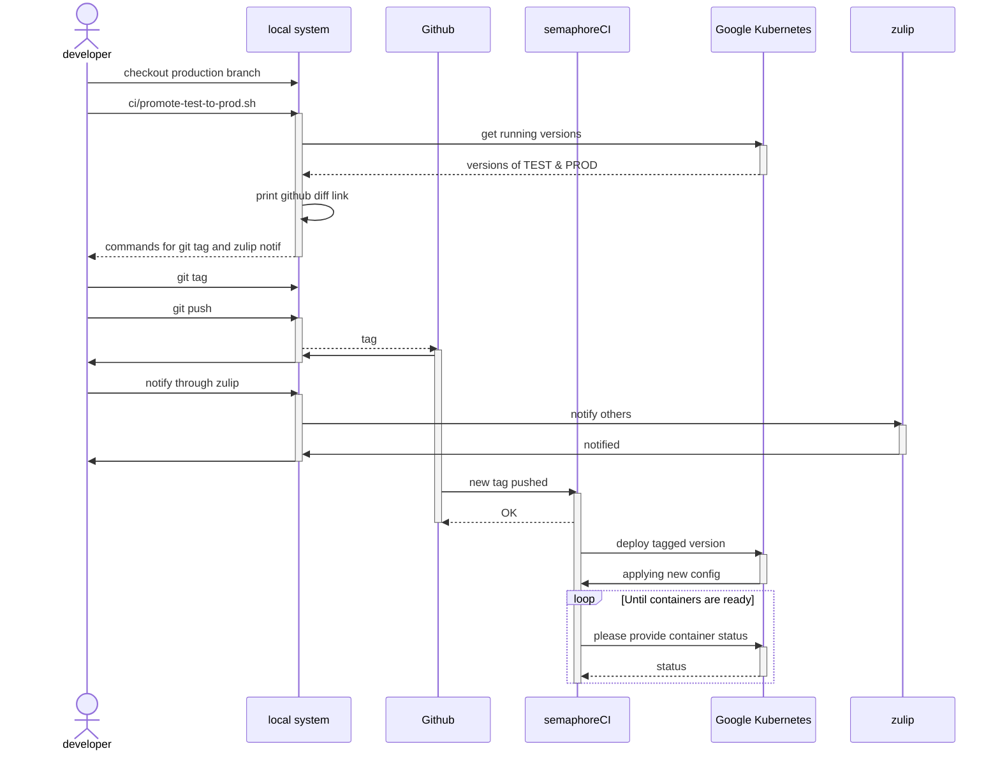

# Deploying

We use SemaphoreCI to deploy to test and production

# Test

Deploying to https://rsr.akvotest.org is done automatically once a PR is merged to master.

# Production

In order to deploy to [production](https://rsr.akvo.org), the docker image must exist in the docker registry.
At the moment, this is all tied to Akvo's private, docker registry on Google Cloud.

The docker image is created during the deployment to the test environment, so that **must** have been done first.

<!-- Edit with https://mermaid.live/ -->
