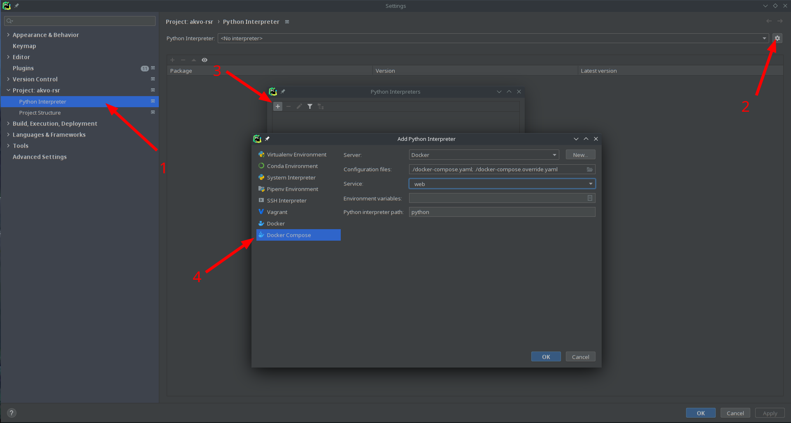
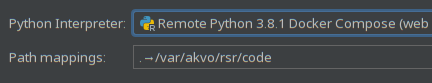
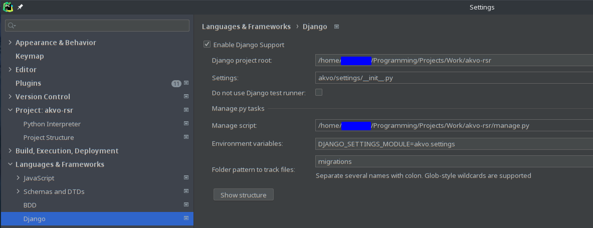
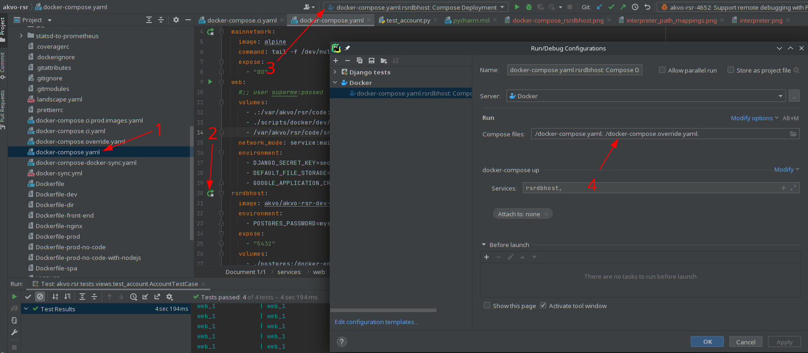
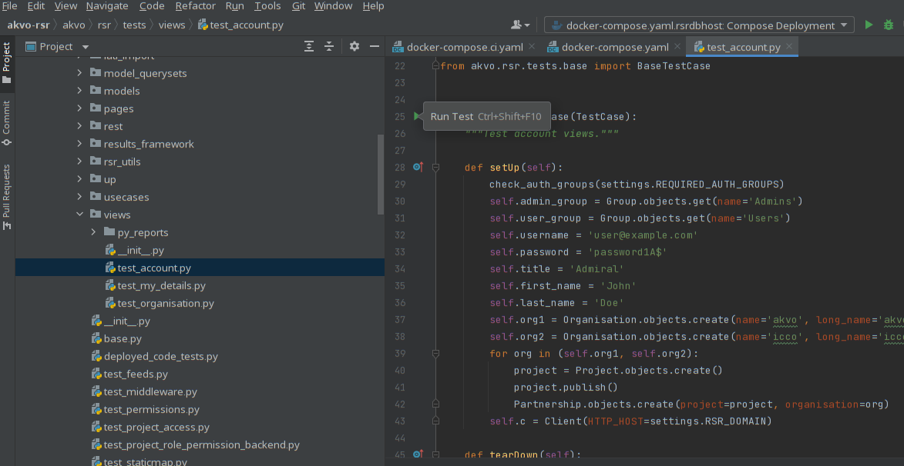

# PyCharm

This project also works well with [Jetbrains' PyCharm IDE][pycharm].

## Setting up remote Python interpreter

[Following the tutorial][remote interpreter], there are only minor modifications we need to make for this project.

 - Add `docker-compose.override.yml` to the files
 - Select the `web` service

Once the interpeter is added, map the local path to the path in the docker container.

## PyCharm django support

PyCharm has additional support for [django related features][pycharm django].
Our specific config looks like this

## Running docker-compose services

It's possible to control many aspects of docker within PyCharm (and other JetBrains products).
Simple ones include starting, stopping, killing, and scaling up services.
It's also possible to start terminals in services (equivalent of `docker-compose exec $service bash`).

We do however need to make PyCharm aware of the `docker-compose.override.yaml`.

## Running tests

With django support activated, we can run tests right from a file or a folder (module or package).

[pycharm]: https://www.jetbrains.com/pycharm/
[pycharm django]: https://www.jetbrains.com/help/pycharm/2021.2/django-support7.html
[remote interpreter]: https://www.jetbrains.com/help/pycharm/2021.2/using-docker-as-a-remote-interpreter.html
